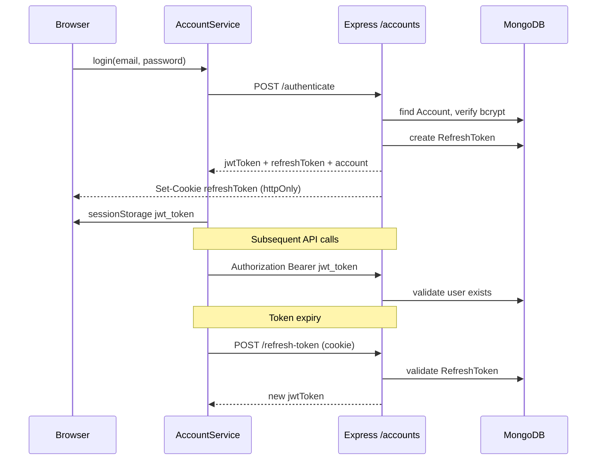
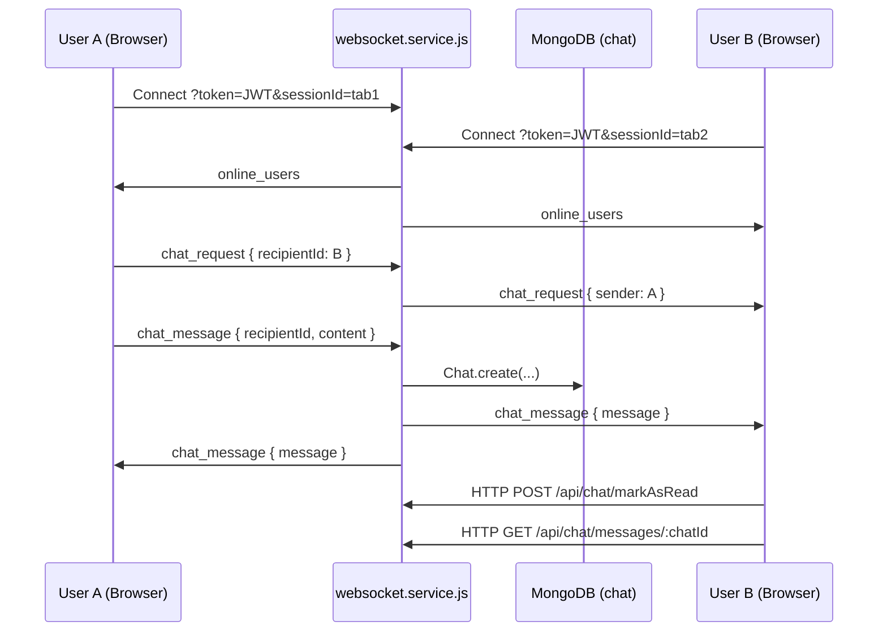

# Application Overview

This document describes how **My Profiling App v17** works at a high level, with emphasis on authentication, real-time chat, role management, and MongoDB data access. It is based on a review of the current codebase.

---

## Table of Contents

1. [Architecture Summary](#architecture-summary)
2. [Authentication](#authentication)
3. [Role Management](#role-management)
4. [Real-Time Chat (WebSockets)](#real-time-chat-websockets)
5. [MongoDB Data Layer](#mongodb-data-layer)
6. [End-to-End Data Flows](#end-to-end-data-flows)
7. [Key File Reference](#key-file-reference)

---

## Architecture Summary

This is a **MEAN stack** application:

| Layer | Technology | Default port |
|-------|------------|--------------|
| **M**ongoDB | Atlas or local MongoDB via Mongoose | — |
| **E**xpress | Node.js REST API + WebSocket server | 5001 |
| **A**ngular | Angular 17 SPA (lazy-loaded modules) | 5000 |
| **N**ode.js | Runs the Express backend | 5001 |

### High-level layout

```
┌─────────────────────────────────────────────────────────────┐
│  Angular 17 SPA (localhost:5000)                                  │
│  ┌─────────────┐  ┌──────────────┐  ┌─────────────────────┐  │
│  │ Account      │  │ Profile /      │  │ Admin / Super-Admin   │ │
│  │ Login        │  │ Templates      │  │ AI Tools              │ │
│  └──────┬──────┘  └──────┬───────┘  └──────────┬──────────┘  │
│          │                 │                       │             │
│          │  HttpClient + JWT Interceptor           │             │
│          │  WebSocket (ChatService)                │             │
└─────────┼────────────────┼─────────────────────┼-───────────┘
           │                 │                       │
           ▼                 ▼                       ▼
┌─────────────────────────────────────────────────────────────┐
│  Express API + WebSocket (localhost:5001)                         │
│  /accounts  /api/posts  /api/gallery  /api/chat  /api/ai          │
│  WebSocket: ws://localhost:5001?token=JWT&sessionId=...           │
└─────────────────────────────┬───────────────────────────────┘
                                 │
                                 ▼
                    ┌──────────────────┐
                    │  MongoDB           │
                    │  profiling-app     │
                    └──────────────────┘
```

### Main feature areas

| Area | Route prefix | Purpose |
|------|--------------|---------|
| Account | `/account` | Login, register, password reset, email verification |
| Profile | `/profile` | User profile editing, timeline, chat dock |
| Profile Templates | `/profile-templates` | Choose and preview profile layout styles |
| AI Tools | `/ai-tools` | OpenAI-powered chat and image description |
| Admin | `/admin` | Account management, session cleanup (Admin+) |
| Super Admin | `/super-admin` | Elevated admin tools (Super-Admin only) |

Protected routes are defined in `src/app/app-routing.module.ts` and guarded by `AuthGuard`.

---

## Authentication

The app supports **two login paths** that both result in an application JWT used for API and WebSocket access.

### 1. Local email / password (primary)

**Flow:**

1. User submits credentials on the login page (`src/app/account/components/login/login.component.ts`).
2. `AccountService.login()` sends `POST /accounts/authenticate` with `{ email, password, rememberMe }` and `withCredentials: true`.
3. The backend (`server/accounts/account.service.js`):
   - Looks up the account by email (case-insensitive).
   - Verifies the account is **verified** and the password matches (`bcryptjs`).
   - Generates a **JWT** (HS256, 30-minute expiry) containing `sub`, `id`, `role`, and `email`.
   - Creates a **refresh token** stored in MongoDB and sets an **httpOnly cookie** named `refreshToken` (7-day expiry).
4. The frontend stores `jwt_token` and `refresh_token` in **sessionStorage** and navigates to the return URL or home.

**Remember me:** If enabled, email is saved in **localStorage** (`remember_me` key) for prefill on the next visit. This does not extend JWT lifetime.

### 2. Auth0 / Google OAuth (optional)

**Flow:**

1. User clicks Google login → Auth0 redirect (`@auth0/auth0-angular`).
2. After Auth0 callback, `Auth0Service` obtains an Auth0 access token and calls `AccountService.loginWithAuth0(token)`.
3. Backend `POST /accounts/auth0/authenticate` validates the Auth0 token (`server/_middleware/auth0.js`), finds or creates an `Account`, and returns an app JWT.
4. New Auth0 users default to role **User** (with hardcoded exceptions for designated Super-Admin emails).

Auth0 login returns an app JWT but does **not** set the refresh-token cookie in the same way as local login; session persistence depends on JWT refresh or re-login.

### Session restore and refresh

On app startup (`src/app/_helpers/app.initializer.ts` → `AccountService.initialize()`):

1. If a valid JWT exists in sessionStorage, the account is restored from the decoded token.
2. Otherwise, `POST /accounts/refresh-token` is called using the httpOnly refresh cookie.
3. A new JWT is stored and a timer refreshes the token ~60 seconds before expiry.

### Logout

`AccountService.logout()`:

1. Calls `POST /accounts/revoke-token` (with Bearer JWT).
2. Clears sessionStorage tokens and resets the account signal.
3. Redirects to `/account/login`.
4. For Auth0 users, also calls Auth0 logout redirect.

An **idle timeout** service (`src/app/_services/idle-timeout.service.ts`) logs out after 20 minutes of inactivity (with a 2-minute warning).

### Token storage summary

| Storage | Key | Contents |
|---------|-----|----------|
| sessionStorage | `jwt_token` | Application JWT (~30 min) |
| sessionStorage | `refresh_token` | Refresh token string |
| httpOnly cookie | `refreshToken` | Refresh token for silent refresh |
| localStorage | `remember_me` | Email prefill metadata (optional) |

### HTTP security layer (Angular)

| Component | File | Behavior |
|-----------|------|----------|
| **JwtInterceptor** | `src/app/_helpers/jwt.interceptor.ts` | Adds `Authorization: Bearer <jwt>` to requests targeting `environment.apiUrl` |
| **ErrorInterceptor** | `src/app/_helpers/error.interceptor.ts` | On 401/403, triggers logout (except revoke-token endpoint) |
| **AuthGuard** | `src/app/_helpers/auth.guard.ts` | Blocks unauthenticated access; optionally checks route roles |

### Backend JWT validation

Primary middleware: `server/_middleware/authenticate.js`

- Verifies JWT signature using the secret from `server/secrets/config.json`.
- Loads the user from MongoDB to ensure the account still exists.
- Supports role-scoped middleware: `authenticate()`, `authenticate(Role.Admin)`, etc.

WebSocket connections use the same JWT secret in `server/services/websocket.service.js` (token passed as a query parameter).

### Authentication diagram



---

## Role Management

### Role values

Roles are plain strings stored on each `Account` document and embedded in the JWT. They must match exactly across frontend and backend:

| Role | Value | Typical access |
|------|-------|----------------|
| User | `User` | Profile, templates, AI tools, own sessions |
| Admin | `Admin` | All User access + `/admin` (account list, session cleanup) |
| Super-Admin | `Super-Admin` | All Admin access + `/super-admin`, password tools, Super-Admin role assignment |

**Frontend enum:** `src/app/_models/role.ts`  
**Backend enum:** `server/_helpers/role.js`  
**Database field:** `Account.role` in `server/accounts/account.model.js`

### How roles are assigned

| Scenario | Default role | Where |
|----------|--------------|-------|
| Self-registration | `User` | `accounts.controller.js` register handler |
| Auth0 new user | `User` (or `Super-Admin` for designated emails) | `handleAuth0Authenticate` |
| Admin promotion | `Admin` | Admin UI, `server/scripts/make-admin.js`, `create-admin.js` |
| Super-Admin assignment | `Super-Admin` | Super-Admin only via admin account edit UI |

### How roles are enforced

**Frontend**

- `AuthGuard` reads `route.data.roles` and compares against `account.role`.
- Navigation links in `new-menu-bar.component.html` show Admin / Super-Admin items based on role.
- `AccountService` exposes computed signals: `isAdmin`, `isSuperAdmin`.

**Route examples** (`app-routing.module.ts`):

| Route | Required roles |
|-------|----------------|
| `/profile`, `/profile-templates`, `/ai-tools` | Any authenticated user |
| `/admin` | `Admin` or `Super-Admin` |
| `/super-admin` | `Super-Admin` only |

**Backend**

- `authenticate(Role.Admin)` allows **Admin and Super-Admin** (Super-Admin is treated as a superset).
- `authenticate(Role.SuperAdmin)` requires exact Super-Admin match.
- Account CRUD in `accounts.controller.js` adds inline checks: only Admins can modify other users; only Super-Admins can modify Super-Admin accounts or assign the Super-Admin role.

**Legacy middleware:** `server/middleware/auth.js` provides `isAdmin` and `isSuperAdmin` used by some older routes (e.g. scripts, posts delete).

---

## Real-Time Chat (WebSockets)

The app supports **peer-to-peer chat between logged-in users** using native WebSockets (the `ws` npm package on the server; browser `WebSocket` API on the client). This is separate from **AI Tools chat**, which uses HTTP to OpenAI.

### Server setup

- Initialized in `server/server.js` after the HTTP server starts: `websocketService.initialize(server)`.
- Shares port **5001** with Express (upgrade on the same HTTP server).
- Implementation: `server/services/websocket.service.js`.

### Connection and authentication

Each browser tab opens a WebSocket with query parameters:

```
ws://localhost:5001?token=<JWT>&sessionId=<unique-tab-id>
```

- `token` — application JWT from sessionStorage; verified with the same secret as REST API.
- `sessionId` — client-generated ID (`session_<timestamp>_<random>`) so one user can have multiple tabs connected.

On connect, the server:

1. Validates the JWT and loads the user from MongoDB.
2. Registers the connection in in-memory maps (`connections`, `userSessions`, `onlineUsers`).
3. Writes a `SessionInfo` audit record (login time).
4. Broadcasts `online_users` to all connected clients.

On disconnect, the server removes the session, updates `SessionInfo` (logout time, duration), and rebroadcasts online users.

### Messaging model

There are **no named rooms**. Messages are routed **directly between two user IDs**.

**Conversation ID** (client-side): sorted participant IDs joined with `-`, e.g. `507f1f77bcf86cd799439011-507f191e810c19729de860ea`.

### WebSocket message types

**Client → Server**

| type | Payload | Purpose |
|------|---------|---------|
| `chat_message` | `{ recipientId, content }` | Send a message |
| `chat_request` | `{ recipientId }` | Notify recipient that someone wants to chat |

**Server → Client**

| type | Payload | Purpose |
|------|---------|---------|
| `online_users` | `{ users: [...] }` | Updated list of online users |
| `chat_message` | `{ message }` | Deliver saved message to sender and recipient |
| `chat_request` | `{ recipientId, sender }` | Incoming chat invitation |
| `new_post` | `{ post }` | Timeline post notification (same WS channel) |

When a `chat_message` is received, the server persists it to MongoDB (`Chat` model) and relays it to **all sessions** of both sender and recipient (multi-tab support).

### REST support for chat history

HTTP routes in `server/services/chat.service.js` (mounted at `/api/chat`):

| Method | Route | Purpose |
|--------|-------|---------|
| GET | `/messages/:chatId` | Load message history for a conversation |
| GET | `/unread/:userId` | Fetch unread messages |
| POST | `/markAsRead` | Mark messages as read |

These routes are used by `src/app/_services/chat.service.ts` for history and read state; real-time delivery uses WebSocket.

> **Note:** The REST chat routes currently do not require JWT middleware. WebSocket connections are authenticated; HTTP chat endpoints trust IDs in the URL/body.

### Frontend chat UI

| Component | Path | Role |
|-----------|------|------|
| **ChatService** | `src/app/_services/chat.service.ts` | WebSocket client, state, dialog management |
| **ChatDockComponent** | `profile-templates/components/chat/chat-dock/` | Online users panel |
| **ChatDialogComponent** | `profile-templates/components/chat/chat-dialog/` | Floating chat window |
| **MinimizedChatComponent** | `profile-templates/components/chat/minimized-chat/` | Minimized chat bar |

The chat dock is mounted on profile pages (e.g. `profile.component.html`). `ChatService` uses an Angular `effect()` tied to `AccountService.account()` — it connects on login and tears down on logout.

### Chat sequence diagram



### Testing multiple users

Because sessionStorage and cookies are per-browser-profile, testing chat between two users requires **different browsers, incognito windows, or browser profiles**. See `docs/GUIDE_TO_TESTING_MULTIPLE_USERS.md`.

---

## MongoDB Data Layer

### Connection

Configured in `server/server.js`:

- **Local dev:** `server/secrets/config.json` → `connectionString` and `DBName` (default database name: `profiling-app`).
- **Production:** `MONGODB_URI` and optional `DB_NAME` environment variables.
- Uses **Mongoose** with `bufferCommands: false` so queries fail immediately if the database is down.
- API routes under `/accounts`, `/api`, `/admin`, and `/upload` return **503** until MongoDB connects.

Model registry: `server/_helpers/db.js` (exports models and `isValidId()` helper).

### Collections and models

| Model | Collection | Purpose |
|-------|------------|---------|
| **Account** | `accounts` | Users, authentication, full profile, template choice, gallery sharing |
| **RefreshToken** | `refreshtokens` | JWT refresh tokens / login sessions |
| **Post** | `posts` | Profile timeline posts |
| **GalleryItem** | `galleryitems` | User gallery media and sharing rules |
| **Chat** | `chat` | Peer chat messages |
| **SessionInfo** | `session-info` | WebSocket login/logout audit |
| **AiDocument** | `aidocuments` | RAG document uploads and embeddings |
| **AiConversation** | `aiconversations` | Per-user AI Chat transcript |
| **AiMemory** | `aimemories` | Per-user long-term facts (name, hobbies, likes, secrets, …) |
| **CleanupHistory** | `cleanuphistories` | Admin session cleanup runs |
| **ScriptRun** | `scriptruns` | Admin script execution history |

> **Important:** There is no separate `profiles` or `templates` collection. Profile fields and `profileTemplateType` live on the **Account** document. Template layouts are defined in Angular (`src/app/_models/profile-template.ts`); only the selected type is persisted in MongoDB.

### Account document (primary entity)

Key fields on `Account` (`server/accounts/account.model.js`):

**Authentication**

- `email`, `passwordHash`, `role`, `verified`, `verificationToken`, `resetToken`
- `auth0Id`, `authProvider` (for OAuth users)

**Profile**

- `firstName`, `lastName`, `profileImage`, `bio`, `position`, `company`
- Address, phone, social links, `skills[]`, `followerImages[]`
- `followersCount`, `followingCount`

**Template**

- `profileTemplateType` — e.g. `STANDARD`, `BUSINESS_CARD`, `SOCIAL_MEDIA`

**Gallery ACL**

- `galleryVisibility`, `gallerySharedWith[]` (references to other Account IDs)

Password hashes are stripped in `toJSON` transforms before API responses.

### REST API pattern

Express routers are mounted in `server/server.js`:

| Mount path | Router | MongoDB entities |
|------------|--------|------------------|
| `/accounts` | `accounts.controller.js` | Account, RefreshToken |
| `/api/posts` | `posts.controller.js` | Post |
| `/api/gallery` | `gallery.controller.js` | GalleryItem, Account |
| `/api/chat` | `chat.service.js` (router) | Chat |
| `/api/ai` | `ai.routes.js` | AiDocument (RAG); AiConversation + AiMemory for chat |
| `/admin` | `admin.controller.js` | CleanupHistory, RefreshToken |

Typical request path:

1. Angular service calls `HttpClient` against `environment.apiUrl`.
2. `JwtInterceptor` attaches the Bearer token.
3. Express `authenticate` middleware validates JWT and loads `req.user`.
4. Controller/service performs Mongoose query (`find`, `findById`, `create`, `findByIdAndUpdate`, etc.).
5. JSON response returned; `ErrorInterceptor` handles auth failures on the client.

### Angular services → API → MongoDB

| Angular service | API base | Primary collections |
|-----------------|----------|---------------------|
| `AccountService` | `/accounts`, `/admin` | accounts, refreshtokens |
| `ProfileTemplateService` | via `AccountService.update()` | accounts (profileTemplateType) |
| `GalleryService` | `/api/gallery`, `/api/hybrid-upload` | galleryitems, accounts |
| `PostService` | `/api/posts` | posts |
| `ChatService` | `/api/chat` + WebSocket | chat, session-info |
| `AiToolsService` | `/api/ai` | aidocuments, aiconversations, aimemories |

**File uploads:** Binary files go to local disk (`server/uploads/`) or S3 via hybrid upload routes. MongoDB stores URLs and metadata on `Account` or `GalleryItem`, not the file bytes.

---

## End-to-End Data Flows

### Login → authenticated API call

```
LoginComponent
  → AccountService.login()
  → POST /accounts/authenticate
  → account.service.js (bcrypt + JWT + RefreshToken)
  → MongoDB: accounts, refreshtokens
  → sessionStorage: jwt_token
  → JwtInterceptor adds Bearer token on all apiUrl requests
  → authenticate middleware → req.user
```

### Profile update

```
Profile UI
  → AccountService.update(id, fields)
  → PUT /accounts/:id
  → accounts.controller.js (ownership / role checks)
  → Account.findByIdAndUpdate
  → MongoDB: accounts
```

### Peer chat message

```
ChatDialogComponent
  → ChatService.sendMessage()
  → WebSocket: { type: 'chat_message', recipientId, content }
  → websocket.service.js
  → Chat.create() → MongoDB: chat
  → WebSocket relay to recipient sessions
  → ChatDialogComponent updates via RxJS subjects
```

### AI document upload (RAG)

```
AiToolsService.uploadDocument()
  → POST /api/ai/documents (multipart)
  → openai.service.js (chunk + embed)
  → AiDocument.create() → MongoDB: aidocuments
  → GET /api/ai/documents lists docs (chunks stripped from response)
```

---

## Key File Reference

### Frontend

| Path | Purpose |
|------|---------|
| `src/app/_services/account.service.ts` | Auth, profile CRUD, sessions, role signals |
| `src/app/_services/auth0.service.ts` | Auth0 → backend JWT exchange |
| `src/app/_services/chat.service.ts` | WebSocket chat client |
| `src/app/_helpers/auth.guard.ts` | Route protection + roles |
| `src/app/_helpers/jwt.interceptor.ts` | Attach JWT to HTTP requests |
| `src/app/_helpers/error.interceptor.ts` | Logout on 401/403 |
| `src/app/_helpers/app.initializer.ts` | Restore session at startup |
| `src/app/_models/role.ts` | Role enum |
| `src/app/_models/account.ts` | Account interface |
| `src/app/app-routing.module.ts` | Top-level routes and guards |
| `src/environments/environment.ts` | `apiUrl`, `wsUrl`, Auth0 config |

### Backend

| Path | Purpose |
|------|---------|
| `server/server.js` | Express app, MongoDB connect, route mounting, WS init |
| `server/accounts/account.service.js` | Auth logic, JWT, refresh tokens |
| `server/accounts/accounts.controller.js` | Account REST routes, role checks |
| `server/accounts/account.model.js` | User/profile schema |
| `server/accounts/refresh-token.model.js` | Refresh token schema |
| `server/_middleware/authenticate.js` | JWT + role middleware |
| `server/_middleware/auth0.js` | Auth0 token validation |
| `server/_helpers/role.js` | Role constants |
| `server/services/websocket.service.js` | WebSocket server |
| `server/services/chat.service.js` | Chat REST routes |
| `server/models/chat.model.js` | Chat message schema |
| `server/models/session-info.model.js` | WS session audit schema |
| `server/_helpers/db.js` | Model exports |

### Related documentation

| Document | Topic |
|----------|-------|
| `docs/README.md` | Setup and quick start |
| `docs/AUTH0_SETUP_GUIDE.md` | Auth0 configuration |
| `docs/GUIDE_TO_TESTING_MULTIPLE_USERS.md` | Multi-user chat testing |
| `docs/ENV-SETUP.md` | Environment variables |
| `docs/DEPLOY.md` | Production deployment (including `wss://`) |

---

## Summary

| Concern | Mechanism |
|---------|-----------|
| **Authentication** | Local JWT (30 min) + httpOnly refresh cookie (7 days); optional Auth0/Google OAuth |
| **Authorization** | Role string on Account + JWT claim; enforced by AuthGuard (client) and authenticate middleware (server) |
| **Real-time chat** | Native WebSocket on port 5001; JWT in query string; messages persisted to `chat` collection |
| **Data storage** | MongoDB via Mongoose; Account is the central document for users and profiles; files stored on disk/S3 with URLs in MongoDB |

This application combines a traditional JWT-secured REST API with a parallel WebSocket layer for live user presence and messaging, all backed by a single MongoDB database.
